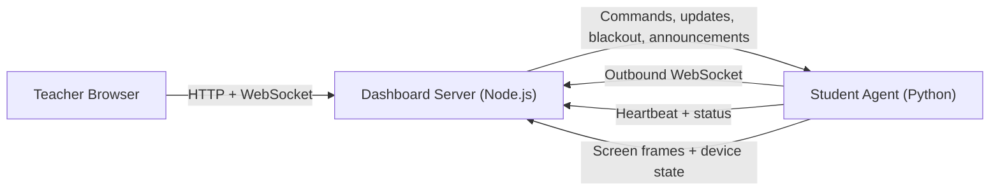

# Architecture

## Components

- `master/` contains the Node.js dashboard server and the browser UI.
- `slave/` contains the Windows classroom agent written in Python.
- `docs/` contains project documentation and the teacher manual served by the dashboard.

## Runtime flow



## Dashboard responsibilities

- Serve the teacher UI from `master/public/`
- Expose login and admin APIs
- Accept websocket connections from teacher browsers and student agents
- Persist accounts, classes, presets, and device assignments
- Broadcast device state, audit events, and live screen frames

## Agent responsibilities

- Discover or connect to the dashboard
- Send heartbeats and device telemetry
- Receive classroom commands from the dashboard
- Show local overlays such as blackout, announcements, and teacher-session banners
- Capture and stream screen previews during active sessions

## Repository layout

```text
.
|-- docs/
|   |-- ARCHITECTURE.md
|   |-- CONFIGURATION.md
|   |-- SETUP.md
|   `-- teacher-account-manual.html
|-- master/
|   |-- package.json
|   |-- server.js
|   |-- data/
|   `-- public/
`-- slave/
    |-- build.bat
    |-- requirements.txt
    |-- slave.py
    `-- slave.spec
```

## Persistence and generated output

- The dashboard writes runtime state to `master/data/classroom-state.json`.
- The PyInstaller build writes generated artifacts to `slave/build/` and `slave/dist/`.
- Local virtual-environment files under `slave/Lib/` and `slave/Scripts/` are development artifacts and are ignored by Git.
